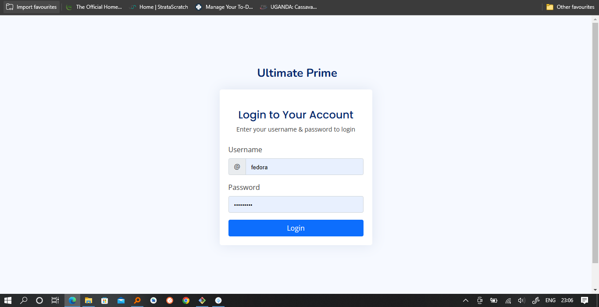
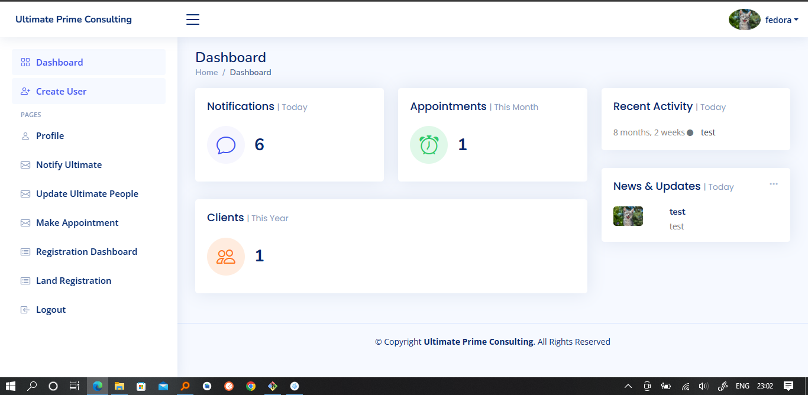

# ultimate

This Project is built on python and django.
To get started follow the following steps.

#### Download Python.
- https://www.python.org/downloads/

#### Create a Visual Enviroment.

- python -m venv env
- More Info : https://docs.python.org/3/library/venv.html

#### Activate the Enviroment

###### Windows
- env\Scripts\activate.bat

###### Mac
- source env/bin/activate

#### Install the Libraries.
- pip install -r requirements.txt

#### Login Page

<!--  -->

#### Dashboard Page
